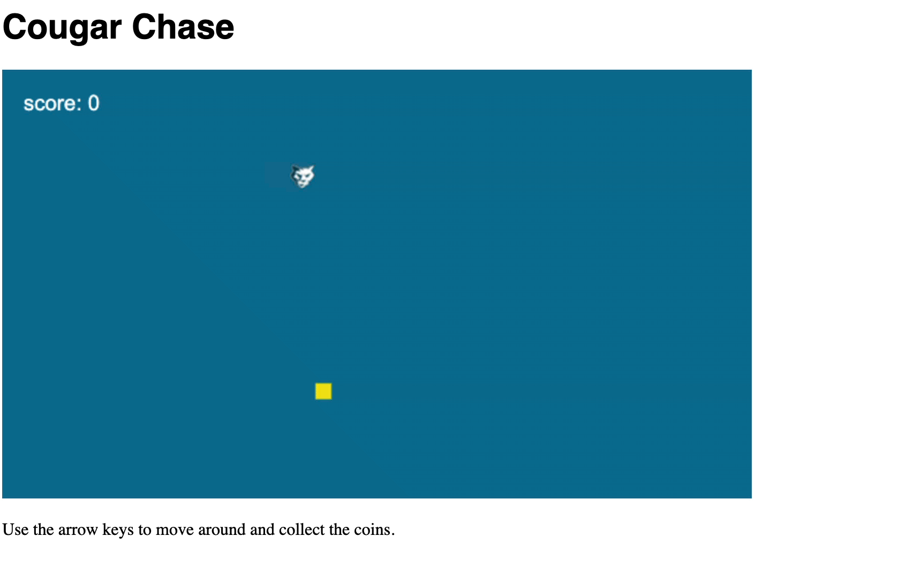
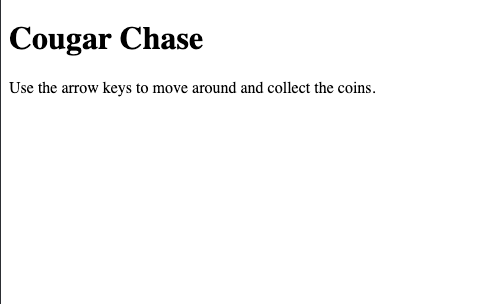
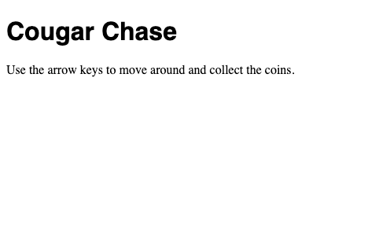

## Cougar Chase

Cougar Chase is a simple yet fun game intended to teach people 12 and older the basics of programming and game development using nothing but a browser, the free open source [Phaser.io](http://www.phaser.io/) game framework, JavaScript and HTML.



Ages - 12+  
Cost - $0  

## Prerequisites

Web Browser and Internet connection. That's it. This workshop was intentinally designed to have the minimal amount of tools and setup necessary to make a functional game. 

## Setup

Instead of using a text editor or IDE to write code, we will use the web site https://jsfiddle.net/. JSFiddle enables us to edit and run JavaScript, HTML and CSS all inside the browser.

1. Using a web browser to navigate, go to https://jsfiddle.net/.


JSFiddle is organized in 4 main quadrants. The top left is where you enter HTML, the code that renders a web page. In the top right is where you enter CSS, the style that makes your web pages look attractive. In the bottom left is where you enter JavaScript, a programming language that adds the behavior and functionality to your application/game. Finally, the bottom right is where you see the results after pressing the run button. This is where you will be able to play the game. 

## Add web page

We will start by adding some basic HTML to host the game.

1. In HTML (top left quadrant), add the following html to create a page with a title of Cougar Chase and a message to the user about how to play the game.
```html
<!DOCTYPE html>
<html>
  <head>
    <title>Cougar Chase</title>
  </head>
  <body>
    <h1>Cougar Chase</h1>
    <p>Use the arrow keys to move around and collect the coins.</p>
  </body>
</html>
```
1. Press the run button.

In Result, you should see a basic white web with the title and message.  



## Add some style

1. In CSS (top right quadrant), add the following CSS to make the title look prettier with a Helvetica font.
```css
h1 {font-family: "helvetica"}
```
1. Press the run button.

In Result, you should see the updated title with the Helvetica font.




## Final Solution

In HTML:

```html
<!DOCTYPE html>
<html>
  <head>
    <meta charset="UTF-8">
    <title>Cougar Chase</title>
    <script src="//cdn.jsdelivr.net/npm/phaser@3.24.1/dist/phaser.min.js"></script>
  </head>
  <body>
    <h1>Cougar Chase</h1>
    <div id="game"></div>
    <p>Use the arrow keys to move around and collect the coins.</p>
  </body>
</html>
```

In CSS

```css
h1 {font-family: "helvetica"}
```

In JavaScript + No-Library (pure JS)

```javascript
class mainScene {
    preload() {
        // Preload assets like sprites and sounds
        this.load.image('player', 'https://cjudd.github.io/basic-js-game-workshop/images/cougar.png');
        this.load.image('coin', 'https://cjudd.github.io/basic-js-game-workshop/images/coin.png');
    }

    create() {
        // Initialize scene with position of game elements
        this.player = this.physics.add.sprite(100, 100, 'player');
        this.coin = this.physics.add.sprite(300, 300, 'coin');
    
        // set, style and display score
		this.score = 0;
		let style = { font: '20px Arial', fill: '#fff' };
		this.scoreText = this.add.text(20, 20, 'score: ' + this.score, style);

        // enable arrow keys
        this.arrow = this.input.keyboard.createCursorKeys();
    }

    update() {
        // update is called 60 times per second and handles game logic

		if (this.arrow.right.isDown) {
		  this.player.x += 3;
		} else if (this.arrow.left.isDown) {
		  this.player.x -= 3;
		} 

		if (this.arrow.down.isDown) {
		  this.player.y += 3;
		} else if (this.arrow.up.isDown) {
		  this.player.y -= 3;
		} 
    
        // collision detection between player and coin
        if (this.physics.overlap(this.player, this.coin)) {
  		    this.hit();
		}
  }
  
    hit() {
  	    // Randomly generate location of new coin
  	    this.coin.x = Phaser.Math.Between(100, 600);
  	    this.coin.y = Phaser.Math.Between(100, 300);

  	    // Increment the score
  	    this.score += 10;
  	    this.scoreText.setText('score: ' + this.score);

	    this.tweens.add({
		    targets: this.player, // on the player 
		    duration: 200, // for 200ms 
		    scaleX: 1.2, // increase scale vertically by 20% 
		    scaleY: 1.2, // increase scale horizontally by 20% 
		    yoyo: true, // at the end, go back to original scale 
	    });
    }
}

new Phaser.Game({
    width: 700, // Width of the game in pixels
    height: 400, // Height of the game in pixels
    backgroundColor: '#097297', // The background color (blue)
    scene: mainScene, // The name of the scene we created
    physics: { default: 'arcade' }, // The physics engine to use
    parent: 'game', // Create the game inside the <div id="game"> 
});
```

Inspired by the LessCake [Learn to make HTML5 games with Phaser 3](https://www.lesscake.com/phaser-game-tutorial){:target="_blank"} tutorial.