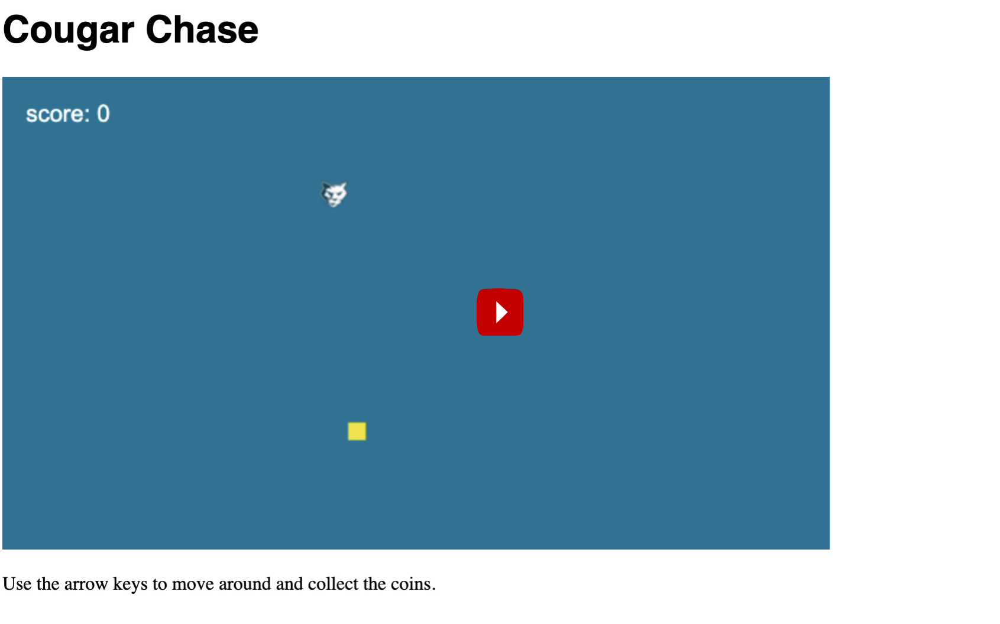

## Cougar Chase

Cougar Chase is a simple yet fun game intended to teach people 12 and older the basics of programming and game development using nothing but a browser and the free open source [Phaser.io](http://www.phaser.io/) game framework.

[](http://www.youtube.com/watch?v=bMUPywVctxE "Cougar Chase Game"){:target="_blank"}

Ages - 12+
Approx. Cost - $22-25
Cost - $0

## Prerequisites

Web Browser and Internet connection. That's it. This workshop was intentinally designed to have the minimal amount of tools and setup necessary to make a functional game.


## Final Solution

In HTML:

``` HTML
<!DOCTYPE html>
<html>
  <head>
    <meta charset="UTF-8">
    <title>Cougar Chase</title>
    <script src="//cdn.jsdelivr.net/npm/phaser@3.24.1/dist/phaser.min.js"></script>
  </head>
  <body>
    <h1>Cougar Chase</h1>
    <div id="game"></div>
    <p>Use the arrow keys to move around and collect the coins.</p>
  </body>
</html>
```

In CSS

``` CSS
h1 {font-family: "helvetica"}
```

In JavaScript + No-Library (pure JS)

``` JavaScript
class mainScene {
  // The 3 methods currenlty empty

  preload() {
    // This method is called once at the beginning
    // It will load all the assets, like sprites and sounds  
    // Parameters: name of the sprite, path of the image
		this.load.image('player', 'https://s3.amazonaws.com/www.juddsolutions.com/phaser/cougar.png');
    this.load.image('coin', 'https://s3.amazonaws.com/www.juddsolutions.com/phaser/coin.png');
  }
  create() {
    // This method is called once, just after preload()
    // It will initialize our scene, like the positions of the sprites
    // Parameters: x position, y position, name of the sprite
		this.player = this.physics.add.sprite(100, 100, 'player');
    this.coin = this.physics.add.sprite(300, 300, 'coin');
    // Store the score in a variable, initialized at 0
		this.score = 0;

		// The style of the text 
		// A lot of options are available, these are the most important ones
		let style = { font: '20px Arial', fill: '#fff' };

		// Display the score in the top left corner
		// Parameters: x position, y position, text, style
		this.scoreText = this.add.text(20, 20, 'score: ' + this.score, style);
    this.arrow = this.input.keyboard.createCursorKeys();
  }
  update() {
    // This method is called 60 times per second after create() 
    // It will handle all the game's logic, like movements
    // Handle horizontal movements
		if (this.arrow.right.isDown) {
		  // If the right arrow is pressed, move to the right
		  this.player.x += 3;
		} else if (this.arrow.left.isDown) {
		  // If the left arrow is pressed, move to the left
		  this.player.x -= 3;
		} 

		// Do the same for vertical movements
		if (this.arrow.down.isDown) {
		  this.player.y += 3;
		} else if (this.arrow.up.isDown) {
		  this.player.y -= 3;
		} 
    
    // If the player is overlapping with the coin
		if (this.physics.overlap(this.player, this.coin)) {
  		// Call the new hit() method
  		this.hit();
		}
  }
  
  hit() {
  	// Change the position x and y of the coin randomly
  	this.coin.x = Phaser.Math.Between(100, 600);
  	this.coin.y = Phaser.Math.Between(100, 300);

  	// Increment the score by 10
  	this.score += 10;

  	// Display the updated score on the screen
  	this.scoreText.setText('score: ' + this.score);
    
    // Create a new tween 
		this.tweens.add({
		  targets: this.player, // on the player 
		  duration: 200, // for 200ms 
		  scaleX: 1.2, // that scale vertically by 20% 
		  scaleY: 1.2, // and scale horizontally by 20% 
		  yoyo: true, // at the end, go back to original scale 
		});
	}
}

new Phaser.Game({
  width: 700, // Width of the game in pixels
  height: 400, // Height of the game in pixels
  backgroundColor: '#097297', // The background color (blue)
  scene: mainScene, // The name of the scene we created
  physics: { default: 'arcade' }, // The physics engine to use
  parent: 'game', // Create the game inside the <div id="game"> 
});
```

Inspired by the LessCake [Learn to make HTML5 games with Phaser 3](https://www.lesscake.com/phaser-game-tutorial){:target="_blank"} tutorial.